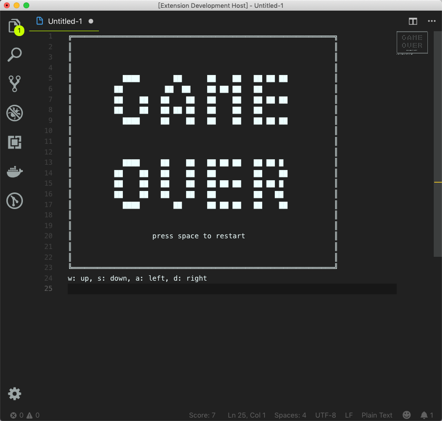

# visual-snake-code README

This game is an old school snake game that runs as a VS Code extension. Please read the requirements before using.

## Features

Press 'w' to go up, similarly 's' for down, 'a' for left, 'd' for right. At the end screen, you can press space to restart a game.
### Screenshot 1:

### Screenshot 2:

## Requirements

After installing the extension, press Ctrl(Command) + shift + p to open the shortcut for command. Type 'Visual Snake Code', then press enter the game will start. 

A suggestion is that you can disable editor.quickSuggestions to prevent the intellisense popping up every time when you press a key.

## Extension Settings

No settings.

## Known Issues

Sometimes the tail pixel doesn't function well, it drops. This bug is to be fixed.

## Release Notes

### 1.0.0

Initial release of Visual Snake Code.

### 1.0.1

Add Change Log and Repository.

### 1.0.2

Minor fixes.

### 1.0.3

Fix a bug that tail drops sometimes.

**Enjoy!**
